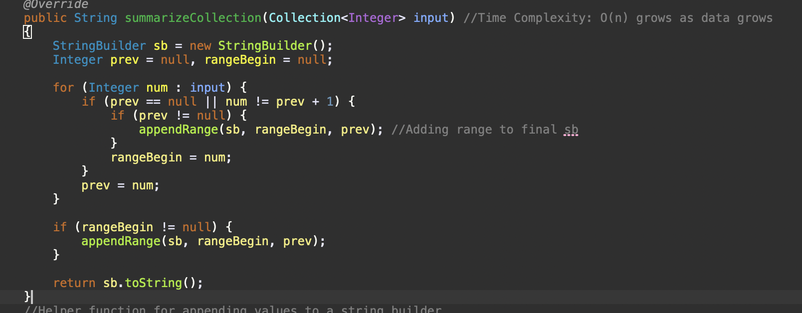
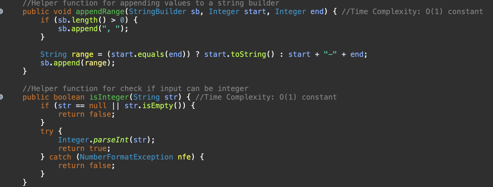
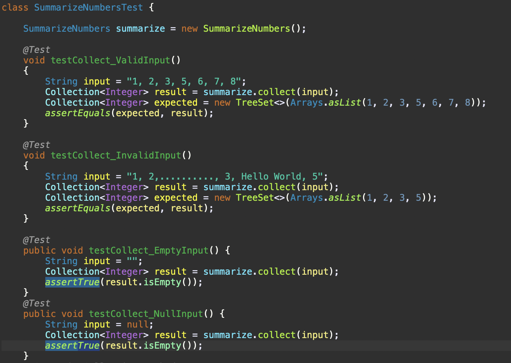

# Assessment Documentation

## Table of Contents

- Introduction
  
- SummarizeNumbers Methods

- SummarizeNumbersTest Methods
  
- Conclusion

## Introduction

Hello, in this repo you will find code that produces a comma delimited list of numbers and group them into a range when they are sequential. The collection i chose to do so is a TreeSet. I chose thise because it is memory efficient since it automatically sorts all the input i give it and it avoids duplicates. This is good because it prevents us from writing code for sorting the input and checking for duplicates which prevents us from wasting memory and promotes code readability since we have fewer lines of code to deal with.

## SummarizeNumbers Methods

In this class I implemented 4 methods, 2 of which are implemented from an Interface and 2 of which are Helper functions.

Looking at the "collect" method, it designed to take a string of comma separated numbers and convert them into integers. I used a helper function called isIntger to pass our string to see if we have actual numbers in the string. Since we are using the TreeSet to sort data and to make sure there is no duplication, it has a Time Complexity of O(nlogn). I then proceed to demonstrate my knowledge of Java 8 features by using both Method References and lambda expression while making use of the Stream API to process the input into integer values.

Looking at the summarizeCollection method, we use it to take the integers we got from the collect method and either separate in commas or put them in ranges if they are sequential. To do this i used a StringBuilder because strings are immutable. This means that once we create a string and assign a value to it and then change that value, the old value will still be retained in memory and the new value will be allocated a new place in the memory pool which can be very inefficient. Whereas with String builders we can use that single memory location and modify it as we wish without affecting perfomance. I used a helper function to append our values into a string builder since we repeat the process twice this will help avoid code duplication. The Time Complexity of this method is O(n) since it is affected by how much data we give it, the more data we give it the more the complexity grows linearly.

Helper Functions:

## SummarizeNumbersTest Methods
For the SummarizeNumbersTest.java file, i implemented unit tests for each method i made to ensure that the code i wrote is reliable and does not break if given different cases to work with. I first tested how it works with the correct input, i then implemented a test of what happens when we use incorrect input and i then tested what happens if we dont give it input at all. Ofcourse i had to add some more functionality when i realized my test were failing. All tests are passed which means my code runs as it should.

## Conclusion

I learned alot while making this project and i would like to thank the wonderful team at Impact.com for giving me an opportunity to learn and to show myself as a developer.
