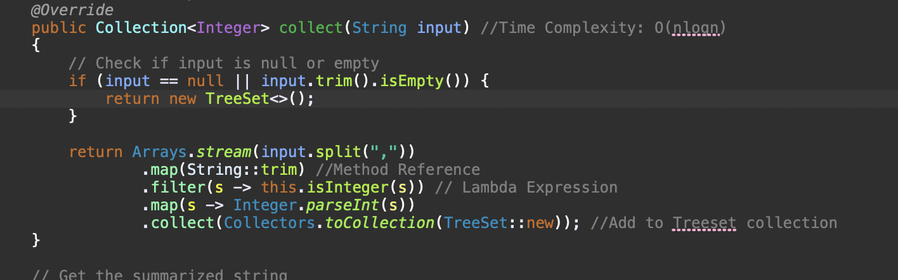

# Assessment Documentation

## Table of Contents

- Introduction
  
- SummarizeNumbers.java Methods

- SummarizeNumbersTest Methods

## Introduction

Hello, in this repo you will find code that produces a comma delimited list of numbers and group them into a range when they are sequential. The collection i chose to do so is a TreeSet. I chose thise because it is memory efficient since it automatically sorts all the input i give it and it avoids duplicates. This is good because it prevents us from writing code for sorting the input and checking for duplicates which prevents us from wasting memory and promotes code readability since we have fewer lines of code to deal with.

## SummarizeNumbers.java Methods

In this class I implemented 4 methods, 2 of which are implemented from an Interface and 2 of which are Helper functions.

Looking at the "collect" method, it designed to take a string of comma separated numbers and convert them into integers. Since we are using the TreeSet to sort data and to make sure there is no duplication, it has a Time Complexity of O(nlogn). I then proceed to demonstrate my knowledge of Java 8 features by using both Method References and lambda expression while making use of the Stream API.

